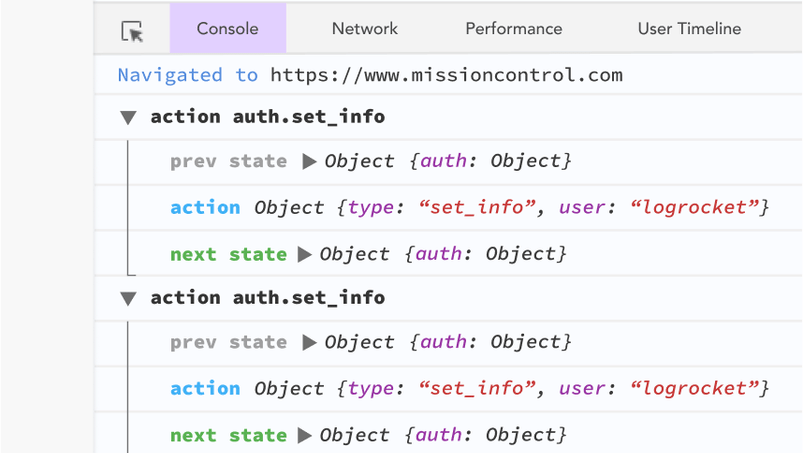

class: middle,center
<style>
  p { font-size: 150% } 
  li { font-size: 150% } 
  .remark-code {  font-size: 120% }
  .small { font-size: 70% }
</style>

# Reduce

---


# Reduce

FP is all about identifying patterns in our code and extract these patterns into functions. 

<!--- 
from https://medium.com/@zaid.naom/exploring-folds-a-powerful-pattern-of-functional-programming-3036974205c8 by 
--->

---

# Identify common patterns

```typescript
var sum = function(list) {
  var totalSum = 0;
  for(var i = 0; i < list.length; i++) {
      totalSum = totalSum + list[i];
  }
  return totalSum;
};

sum([1, 2, 3]) // 6
```

---

# Identify common patterns

```typescript
var product = function(list) {
  var result = 1;
  for(var i = 0; i < list.length; i++) {
    result = result * list[i];
  }
  return result;
};

product([1, 2, 3, 4, 5]) // 120
```

---

# Identify common patterns

```typescript
var count = function(list) {
  var totalCount = 0;
  for(var i = 0; i < list.length; i++) {
      totalCount = totalCount + 1;
  }
  return totalCount;
}

count([1, 2, 3]) // 3
```

---

# Identify common patterns

```typescript
var forAll = function(list) { 
  var result = true;
  for(var i = 0; i < list.length; i++) {
    result = result && list[i];
  }
  return result;
}
```

---

# Common pattern

* We have the Initial Value (totalSum, result, totalCount etc.) that we are defining at the very beginning. This initial value is also called the Identity Value or the Neutral Element.
* We are going through all the elements within the input list (traversing the list).
* We are doing an Operation inside the for-loop and accumulating the result before returning it.

---

# Extracting the common parts and variables
## Common parts
traversing the list
## Variables
* Initial Value
* Operation

---

# Extracting the common parts and variables

```typescript
type FuncType<S,T> = (cur:S,acc:T) => T

const MyReduce = <S,T>(f : FuncType<S,T>, identity:T, list : S[] ) => {
    var acc = identity;
    for (let i = 0; i < list.length; i++) {
        acc = f(list[i],acc)
    }
    return acc;
}
```

---

# Implements with reduce(1)
```typescript
const _add = (acc:number,cur:number)=>acc+cur;
const MySum = (list:number[])=>MyReduce(_add,0,list)

const _max = <T>(acc:T,cur:T)=>cur>acc?cur:acc
const MyMax = <T>(list:T[])=> MyReduce(_max,list[0],list)

const _length = <T>(cur:T,acc:number) => acc + 1;
const MyLength = <T>(list:T[])=>MyReduce(_length,0,list);
```

---

# Implements with reduce

Filter:

```typescript
console.log(filter((x:number)=>x>2,[1,2,3,4]))
//[3,4]
```

--

```typescript
// (T,T[]) => T[]
const MyFilter = <T>(pred:(v:T)=>boolean, list:T[]):T[]=>
    MyReduce( (cur:T, acc:T[])=>pred(cur)?[...acc,cur]:acc ,[],list)
console.log(MyFilter((x:number)=>x>2,[1,2,3,4]))
```

---

# Implements with reduce

Map:

```typescript
//(a->b) -> [a]->[b]
const MyMap = <A,B>(func:(a:A)=>B,values:A[])=>
    //a -> [b] -> [b]
    MyReduce((a:A,acc:B[])=>[...acc,func(a)],[],values)


console.log(MyMap((x:number)=>"_"+x+"_",[1,2,3,4]))

```

---

# Exercise

forAll : a -> bool -> [a] -> bool
forAll((x:number)=>x>0,[1,2,3,5]) => true
forAll((x:number)=>x>0,[1,2,-1,5]) => false

please implement forAll with reduce

---

# Example : Project Euler P22

Using names.txt , a text file containing over five-thousand first names, begin by sorting it into alphabetical order. Then working out the alphabetical value for each name, multiply this value by its alphabetical position in the list to obtain a name score.

---

# Example : Project Euler P22

For example, when the list is sorted into alphabetical order, COLIN, which is worth 3 + 15 + 12 + 9 + 14 = 53, is the 938th name in the list. So, COLIN would obtain a score of 938 × 53 = 49714.

What is the total of all the name scores in the file?

---

# In procedure javascript

```javascript
var names = (text.split(",")).sort();
var total = 0;
for (let h = 1; h <= names.length; h++) {
	let i = (names[h-1]).toLowerCase();
	let sum = 0;
	for (let j = 0; j <= i.length - 1; j++) {
		sum = sum + i.charCodeAt(j)-96;
	}
	total = total + (sum * h)
}
console.log(total)
```

---

# In functional typescript
[word] -> [sorted word] -> [sum of word] -> [sum of word with worth] -> total

---

# In functional typescript
```typescript
const indexOfChar = (x:string)=>x.charCodeAt(0)-'A'.charCodeAt(0)+1

//word:string -> sumOfWordChar:number
const sumOfWordChar = (word:string):number => word.split('')
        .map(indexOfChar)
        .reduce(add)

//words:[string] -> sumOfWordWorth:number
const sumOfWordsWorth = (words:string[]):number =>words.sort()
        .map(sumOfWordChar)
        .map((x,i)=>x*(i+1))
        .reduce(add)

trace(sumOfWordsWorth(names))
```

---

# Redux

<!---
https://www.freecodecamp.org/news/from-reduce-to-redux-understanding-redux-by-building-redux-918ef08abafe/
--->

* Redux takes a functional approach to modeling data, which challenges the traditional MVC pattern.
* Redux uses reducer functions to manage application state. A Redux-style reducer takes the current state and an action object and returns the new state.

---

# A state management tool

* We can model application behavior as responses to a stream of actions. 
* Each response to an action return a new application state.

signature of reducer:
(a->b->b) -> b -> [a] -> b

model of application state management 

(action->state->state) -> state -> [actions] -> state

---

# OO style counter example

```typescript
class Counter{
    constructor(){
        this.count = 0;
    }
    count : number
    inc(){
        this.count =  this.count + 1;
    }
    dec(){
        this.count = this.count - 1;
    }
}
```

---

# OO style counter example

```typescript
const counter = new Counter();

counter.inc();
counter.dec();
```

---

# FP style Counter example

```typescript
type ActionType = "inc" | "dec" 

const reducer = (state = {count:0}, action:Action<ActionType> ) => {
    switch(action.type){
        case "inc":{
            return {count:state.count+1}
        }  
        case "dec":{
            return {count:state.count-1}
        }
        default:{ return state}
    }
}
```

---

# FP style Counter example

1. A reducer called with no parameters should return its valid initial state.
2. If the reducer isn’t going to handle the action type, it still needs to return the state. 
3. Redux reducers must be pure functions.

---

# FP style Counter example
```typescript
const store = createStore(reducer)

store.dispatch({type:"inc"})
store.dispatch({type:"dec"})
```

---

# Redux: Benefits 

Redux makes the state predictable

If the same state and action are passed to a reducer, the same result is always produced as reducers are pure functions.

---

# Redux: Benefits 

Traceable with tools


---

# Redux: Benefits 

Change state storage strategy,  even manage state in server side.


