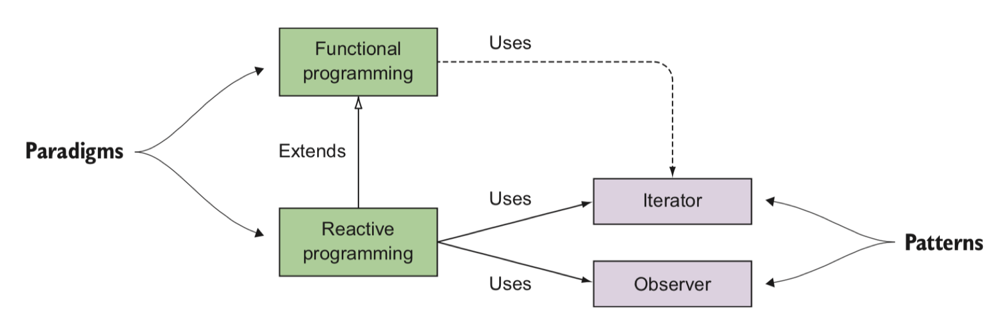
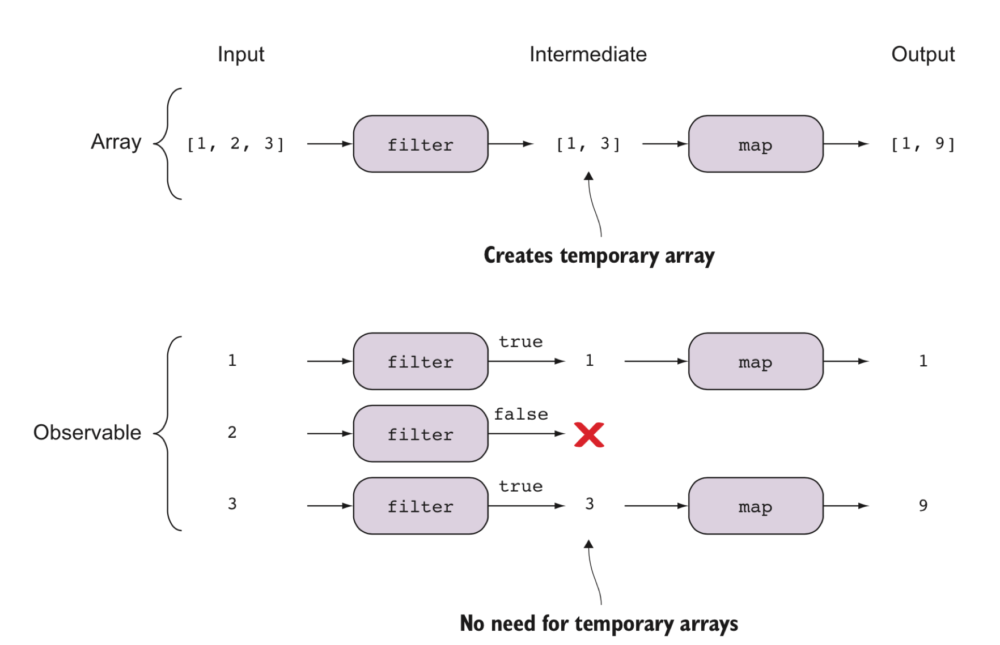

class: middle,center
<style>
  p { font-size: 150% } 
  li { font-size: 150% } 
  .remark-code {  font-size: 110% }
  .small { font-size: 70% }
</style>

# Functional Reactive Programming

---

# What is Reactive Programming

## The Reactive Manifesto

* **Responsive** :  The system responds in a timely manner 
* **Resilient**: The system stays responsive in the face of failure.
* **Elastic** : The system stays responsive under varying workload.
* **Message Driven** : Reactive system rely on asynchronous message passing to establish a boundary between components that ensures loose coupling, isolation and location transparency.

---

# What is Reactive Programming


---

# When to use RxJS
|    |One|Many|
|----|---|----|
|**Sync**|object|Iterable object|
|**Async**|Promise[object]| Reactive Programming|

Reactive programming focuses on the propagation of changes as streams of events.
---

# From Iterator/Observer Pattern to FRP


Sample

---

# Reactive and Functional Programming

The abstractions that support RP are built on top of FP, so FP is the foundation for RP.

Rxjs is a sub-project of ReactiveX project.

ReactiveX is a combination of the best ideas from the Observer pattern, the Iterator pattern, and functional programming.

---

# Reactive Programming and Functional Programming




---

# Compare Iterator and Reactive Stream
Iterator:
```typescript
[1,2,3]
  .filter(x=>x%2!==0)
  .map(x=>x*x)
  .forEach(console.log)
```

Observer
```typescript
from([1,2,3])
  .pipe(
    filter(x=>x%2!==0),
    map(x=>x*x)
  )
  .subscribe(console.log)
```

---

# Compare Iterator and Reactive Stream

Observer for UI events

---
# Compare Iterator and Reactive Stream
What's different?



---

# Reactive Stream : Type ahead example

How to get product suggestions from Taobao?

<!--
mac 上禁止跨域警告：
open -n -a /Applications/Google\ Chrome.app/Contents/MacOS/Google\ Chrome --args --user-data-dir="/tmp/chrome_dev_test" --disable-web-security
demolocation:../slides_demo/rxjs-suggestion
-->

* Step 1: create a promise to fetch data from taobao
* Step 2: model suggestions as a stream with transformation:

1. keyup-event stream
2. text stream
3. suggestions stream

---

# Reactive Stream : Type ahead example
Step 1:
```typescript
const getTaobaoSuggestions = (name: string) =>
  fetch("https://suggest.taobao.com/sug?code=utf-8&q=" + name)
    .then(x => x.json())
    .then(x => x.result)
```

# Reactive Stream : Type ahead example
Step 2:

```typescript
fromEvent(input, 'keyup')
  .pipe(
    debounceTime(200),
    map((e: any) => e.target.value),
    switchMap(getSuggestions),
  )
  .subscribe(
    c => output(c.join('\n'))
  );
```

# Subject
A Subject is a special type of Observable that allows values to be multicasted to many Observers.

```typescript
const sub = new Subject();

sub.next(1);
sub.subscribe(console.log);
sub.next(2); // OUTPUT => 2
sub.subscribe(console.log);
sub.next(3); // OUTPUT => 3,3 (logged from both subscribers)
```

# Behavior Subject
A variant of Subject that requires an initial value and emits its current value whenever it is subscribed to.

```typescript
const subject = new BehaviorSubject(123);

// two new subscribers will get initial value => output: 123, 123
subject.subscribe(console.log);
subject.subscribe(console.log);

// two subscribers will get new value => output: 456, 456
subject.next(456);

// new subscriber will get latest value (456) => output: 456
subject.subscribe(console.log);

// all three subscribers will get new value => output: 789, 789, 789
subject.next(789);

// output: 123, 123, 456, 456, 456, 789, 789, 789
```
